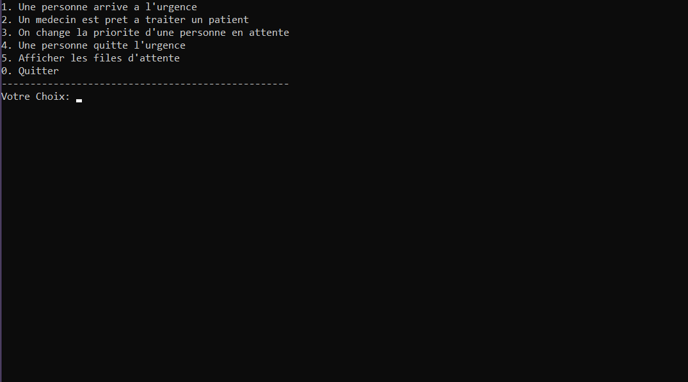
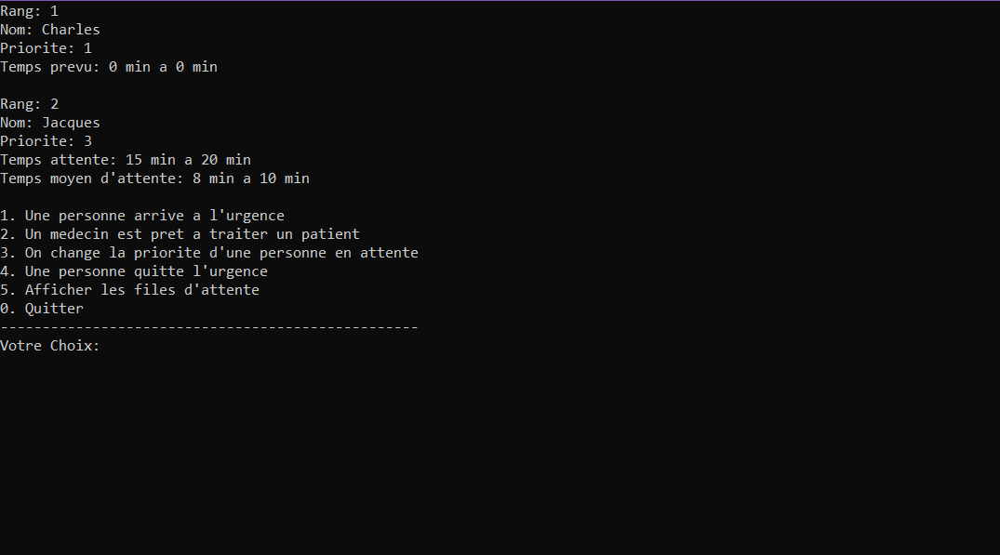

# Hospital-Simulation

Command line hospital simulation in C++ designed for a school project.

## TECH STACK

- C++

## RUN LOCALLY

```
$ git clone https://github.com/Charles9869/Hospital-Simulation.git
```

## SCREENSHOTS




